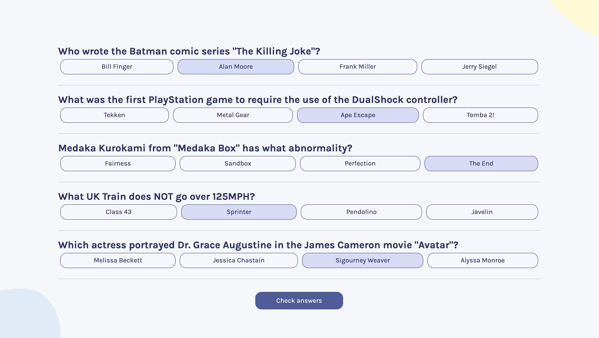

# Quizzical - Trivia Quiz App

Welcome to the Quizzical app! This solo project, which I developed as part of the Scrimba Frontend Developer Career Path, is a dynamic web application that allows users to test their trivia knowledge across various topics. The application fetches questions from a trivia API and provides immediate feedback on answers.



## Features

- Dynamic question generation from an API.
- Immediate feedback on selected answers.
- Results summary page with correct answer highlights.

## Live Demo

You can try out the live version of the app here: [Quizzical Live Demo](https://calm-vacherin-07a408.netlify.app/)

## Quick Start

To get started with the Quizzical app, you can clone the repository and install dependencies:

```
$ yarn # or npm install
$ yarn build # or npm run build
````

## Development

Run Webpack in watch-mode to continually compile the JavaScript as you work:

```
$ yarn watch # or npm run watch
```

## About Scrimba

At Scrimba our goal is to create the best possible coding school at the cost of a gym membership! 💜
If we succeed with this, it will give anyone who wants to become a software developer a realistic shot at succeeding, regardless of where they live and the size of their wallets 🎉
The Frontend Developer Career Path aims to teach you everything you need to become a Junior Developer, or you could take a deep-dive with one of our advanced courses 🚀

- [Our courses](https://scrimba.com/allcourses)
- [The Frontend Career Path](https://scrimba.com/learn/frontend)
- [Become a Scrimba Pro member](https://scrimba.com/pricing)

Happy Coding!
